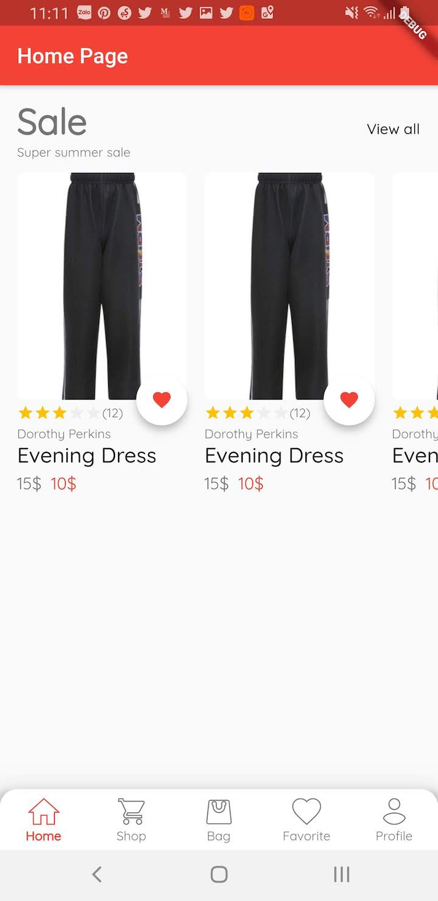

# Flutter E-Commerce Mobile

Demo cho ứng dụng TMDT với Flutter. Ứng dụng này viết lúc nhàn dỗi nhằm mục đích có cái ae trong team review góp ý.

## Getting Started
Design app tham khảo Figma ở link này:

[Design Figma](https://www.figma.com/file/RP12HfFdgvuitYP6lz8X3h/E-commerce-Application-by-Fively-%2F-Light-Version-(Copy)?node-id=91%3A274&viewport=1266%2C-486%2C1.3325926065444946 
)
### Ngày 1:
Tạo được cái khung với app với các thành phần sau:

- Dynamic Theme cho phép config support thay đổi darkmode sau này.
    
    `lib/theme/dynamic_theme_widget.dart`
    
- Màn hình Main với _BottomNavigationBar_ có 5 tab như design.

    `lib/features/main_page.dart`
    
    
- Widget cho phần home(Title, Group Product)

    `lib/widgets/simple_title_widget.dart`
    
    `lib/widgets/product_widget.dart`
    
#### Kết quả:
|        |            |   |
| ------------- |:-------------:| -----:|
| { width=50% }| | |